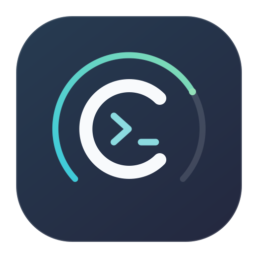
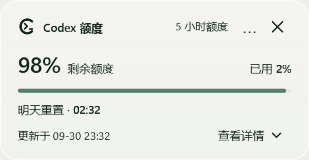
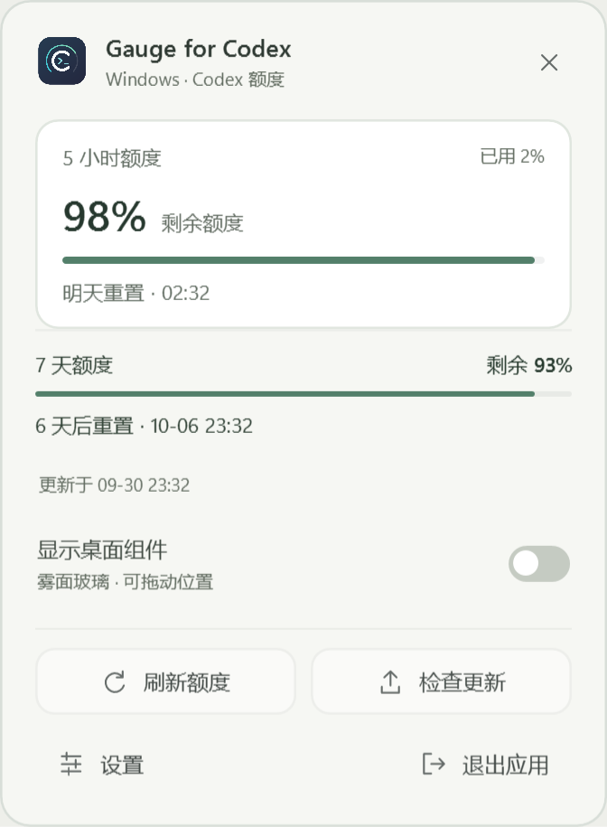
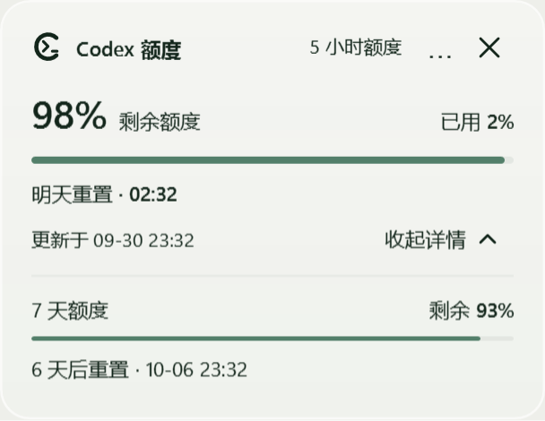
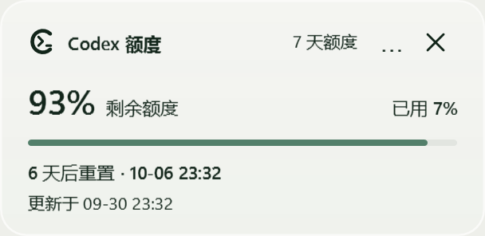
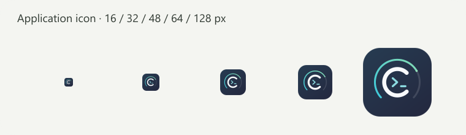
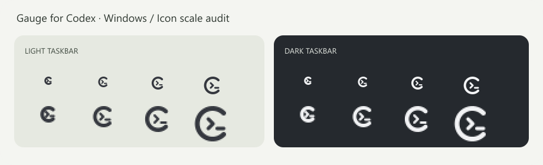
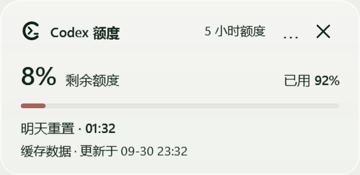
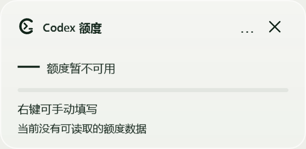

# Gauge for Codex · Windows 版

简体中文 · [English](README.md)

> 独立社区工具，与 OpenAI 没有隶属、合作或背书关系。

> 1.0.0：实色托盘浮窗、独立雾面桌面组件、清晰的 DPI 托盘图标，以及不重复的双周期额度展示。



在 Windows 右下角随时查看 Codex 额度，按需开启柔和的雾面玻璃桌面卡片。
与 Mac 版同名，保持同一产品识别；[Mac 仓库](https://github.com/qingtan-labs/GaugeForCodex)继续独立维护。



预览使用示例额度，不是个人账号数据；实际模糊和透色随系统设置、背景而变化。

[下载 1.0.0](https://github.com/qingtan-labs/GaugeForCodex-Windows/releases/tag/v1.0.0) · [完整使用说明](docs/user-guide.zh-Hans.md) · [隐私](PRIVACY.md) · [安全](SECURITY.md) · [使用帮助](SUPPORT.md)

## 界面图例

### 托盘快捷面板



主额度放在摘要区；其他周期逐行列出。桌面组件用明确开关控制，刷新与检查更新并排，设置与退出在底部，不再堆叠大按钮。点击空白处或按 Esc 收起面板。

托盘浮窗采用正常实色面板，不使用毛玻璃；只有可选的桌面组件保留背景模糊。组件默认底色浓度为 58%，可在 56–70% 内调节；文字独立保持不透明，不随背景一起模糊。

### 雾面玻璃组件：收起与展开





多档额度时，底部 **查看详情 ▾** 展开后变为 **收起详情 ▴**，只列出主卡片以外的周期；只有一档或没有数据时直接隐藏入口，刷新成单档时也会收起旧详情。服务端重复字段会去重；周额度偏低或耗尽时，收起状态仍有简短提醒。按钮支持键盘 Tab 与 Enter。图例使用示例额度渲染，不是桌面截屏；实时背景模糊与透色由 Windows 合成。

### 软件图标与浅/深色托盘




软件图标保持 Mac 版的 C＋终端符号，额度弧更细、更内收；托盘使用加粗、按像素对齐的单色图形，自动匹配任务栏浅/深色，缩放变化和更新提示后仍加载原生尺寸。上图来自实际 ICO 图层，仅是尺寸检查板，不是任务栏截图。参见[清晰度检查说明](docs/tray-clarity.md)。

### 低额度与数据未知




剩余额度少于 20% 时进度条变为低饱和红色，同时保留数字，不单靠颜色传达状态。缓存标明来源及更新时间；未知值不会冒充 0%。

## 如何使用

单击托盘 C＋终端标识，查看缩略额度和操作；右键打开快捷菜单。Windows 若将图标藏进“小箭头”，可拖到常显区域。
开启“显示桌面组件”后，卡片默认位于右下角，可拖动并记住位置，默认不置顶。
点击卡片的 × 仅隐藏组件，托盘仍保留；“退出应用”关闭额度界面并停止刷新，本次 Codex 会话不会自动拉起。小型跟随监控可在下次 Codex 桌面启动时重新打开。

| 入口 | 行为 |
| --- | --- |
| 托盘单击 / 右键 | 摘要面板 / 完整快捷菜单 |
| 显示桌面组件开关 | 显示或隐藏卡片，不退出应用 |
| 卡片主体拖动 | 移动并记住位置；操作按钮不触发拖动 |
| 查看详情 / 收起详情 | 仅在多周期时显示，展开其他周期；更新时间始终可见 |
| 面板 × / Esc / 失焦 | 只收起面板 |
| 退出应用 | 停止额度界面与刷新；保留下一次 Codex 启动跟随 |

Plus 返回 5 小时和 7 天两个周期时，主卡片显示 5 小时，展开详情显示 7 天；如果实际只返回周额度，主卡片直接显示周额度且没有详情入口。账户套餐名称不是编造额度窗口的依据。

主题范围：托盘图标跟随任务栏浅/深色；1.0.0 的面板与组件仍为浅色中性配色，尚未提供全界面的“跟随系统 / 亮色 / 暗色”选择。语言可在设置中切换，中文系统首次默认中文，其他系统默认英文。

设计与自查范围见[界面审查记录](docs/design-audit.md)和[1.0.0 验证范围](docs/verification-1.0.0.md)。

## 功能

- 剩余、已用百分比；有实际 5 小时额度时优先显示，详情仅显示其他周期，缺失周期不编造。
- 重置天数和本地时区准确日期时间；明确区分未知、缓存和手动数据。
- 启动时、每 60 秒及唤醒后，通过本机 Codex `account/rateLimits/read` 刷新，不调用模型、不发送提示词。
- 原生 WPF、系统托盘；Windows 11 使用更薄的中性底色与原生背景模糊，不可用时回退系统亚克力或清晰底色。见[雾面与详情设计说明](docs/frost-and-details.md)。
- 可调玻璃浓度、可选置顶、独立桌面组件，托盘快捷面板失焦收起。
- 默认跟随 Codex 启停；也可在设置中选择登录 Windows 时独立启动。
- 每七天自动检查更新一次，仅提醒；可手动检查，点击确认后下载、校验、安装，保留设置及回退副本。
- 中、英、日、西四语言。无广告、遥测、开发者后台，不包含任何小狗素材或宠物逻辑。

## 下载与安装

支持 Windows 10 22H2 或 Windows 11，x64/ARM64，并需安装和登录 Codex 桌面应用。
实时亚克力效果需要 Windows 11 22H2+，且系统透明效果未关闭；高对比度或不支持的图形环境使用后备样式。
ZIP 自带 .NET 8 桌面运行时，无需另外安装 .NET 或 SDK。ARM64 已交叉编译和检查资源，尚未在实体 ARM64 设备上完成桌面交互测试。

先对照发行页 `SHA256SUMS.txt` 校验 ZIP，再解压并运行 `GaugeForCodex.exe`。
可选安装，生成桌面、开始菜单入口和登录跟随监控：

```powershell
# 在解压后的应用目录执行，默认按当前用户安装，不需管理员。
.\install.ps1
# 可指定可写目录：
.\install.ps1 -InstallDir 'D:\aiTools\ChatGPT\GaugeForCodex'
```

设置、额度缓存和更新备份保存在安装目录的 `Data/` 中。不要公开上传该文件夹。
当前发行包未进行 Authenticode 代码签名，Windows 可能提示未知发布者；不要关闭 SmartScreen 或其他安全保护。

## 源码构建

```powershell
dotnet run --project tests/GaugeForCodex.Tests.csproj -c Release -p:TreatWarningsAsErrors=true
.\scripts\build-release.ps1 -Runtime win-x64
.\scripts\build-release.ps1 -Runtime win-arm64
```

软件图标 SVG 与 `scripts/tray-artwork.cjs` 中的分尺寸托盘图形是可编辑原稿，已附带 PNG 和多尺寸 ICO；重新生成需 Node.js 与 `sharp`。
更多内容见[参与贡献](CONTRIBUTING.md)、[发行流程](docs/release-process.md)、[更新记录](CHANGELOG.md)、[第三方与商标说明](NOTICE.md)。

源码与原创图形采用 [MIT](LICENSE)，Codex 名称仅用于说明兼容关系。
