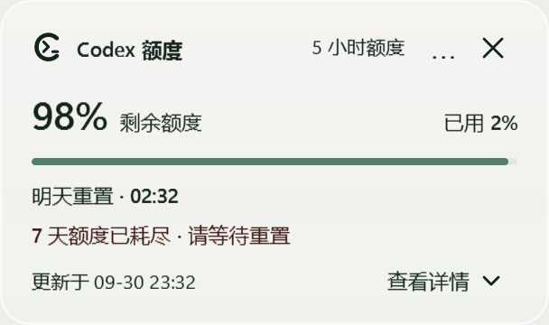

# 1.0.0 使用指南

Gauge for Codex · Windows 是独立额度卡片，不包含宠物。它不是 OpenAI 官方应用，也不会增加或购买额度。

## 下载、启动与安装

在 [1.0.0 发行页](https://github.com/qingtan-labs/GaugeForCodex-Windows/releases/tag/v1.0.0)选择安装包：

| 文件 | 用途 |
| --- | --- |
| `GaugeForCodex-Windows-1.0.0-win-x64.zip` | Intel / AMD Windows 电脑 |
| `GaugeForCodex-Windows-1.0.0-win-arm64.zip` | ARM Windows 电脑 |
| `GaugeForCodex-Windows-1.0.0-source.zip` | 完整源码，不是运行安装包 |
| `SHA256SUMS.txt` | 三个 ZIP 的 SHA-256 校验值 |

ZIP 自带 .NET 8 桌面运行时，不需要另装 SDK。先校验再解压，双击 `GaugeForCodex.exe`，不要从压缩软件的临时预览目录运行。

```powershell
Get-FileHash .\GaugeForCodex-Windows-1.0.0-win-x64.zip -Algorithm SHA256
# 在解压的应用目录创建桌面、开始菜单及登录跟随入口：
.\install.ps1 -InstallDir 'D:\aiTools\ChatGPT\GaugeForCodex'
```

安装到有写入权限的目录，不需管理员。发行包尚未进行 Authenticode 签名；不要关闭 Windows 安全保护。系统要求见主 README。

## 两个界面，各司其职

### 托盘浮窗：临时查看和操作


单击右下角 C＋终端图标打开浮窗。它使用清晰的实色中性背景，**不使用毛玻璃**。主额度、其他周期、重置时间、更新时间与组件开关、刷新、更新、设置、退出集中在这里。

点击 ×、按 Esc 或点击面板外部仅收起浮窗。右键图标可打开完整菜单；看不到图标时先检查任务栏的小箭头隐藏区。

### 桌面组件：持续查看


开启“显示桌面组件”显示小卡片。默认不置顶，拖动主体记住位置，按钮不触发拖动。点击 × 只隐藏组件，托盘继续运行。

组件使用背景模糊，默认中性底色浓度 58%，设置范围 56–70%；数字和文字保持不透明，没有前景模糊效果。底色越浓，背景透色越少；白背景下仍偏浅，深色或彩色背景更容易看出透色。

系统透明效果关闭、高对比度、不支持的 Windows 或合成环境会使用后备底色；程序不会改变这些系统设置。图例是示例额度的应用布局渲染，不是实际桌面背景模糊截图。

## Plus 的 5 小时与周额度

| Codex 实际返回的数据 | 主卡片 | 查看详情 |
| --- | --- | --- |
| 5 小时＋7 天 | 5 小时 | 只显示 7 天 |
| 仅 5 小时 | 5 小时 | 隐藏入口 |
| 仅 7 天 | 7 天 | 隐藏入口 |
| 其他多个周期 | 当前最紧的额度周期 | 其他周期 |
| 无有效数据 | 破折号与不可用说明 | 隐藏入口 |

按真实接口数据展示，不因为套餐叫 Plus 就补造 5 小时窗口。重复同周期字段会去重，数值不一致时采用更保守的已用值。展开详情不会复制主卡片；另一周期低于 20% 或耗尽时，收起状态也有提醒。

剩余 = 100% − 已用；进度条表示**剩余**。百分比可能取整，不是精确 Token 余额，也不是 API 付费账单。




## 重置时间与数据状态

- 时间取自服务端时间戳，以 Windows 本地时区显示。当天显示“今天重置”及时间，跨天显示天数及日期时间；缺少时间戳则显示未知。
- 启动、每 60 秒及唤醒后尝试读取本机 Codex app-server 的 `account/rateLimits/read`，不调用模型或发送提示词。
- 实时读取失败时可显示带更新时间说明的上次成功缓存；缓存不等于实时数据。
- 没有有效数据时不伪装成剩余 0% 或 100%，可右键手动填写并注明来源。
- 浮窗提供“刷新额度”，界面不显示“自动同步 / 等待同步 / 同步中”等背景状态文字。


## 启动、隐藏、退出

| 操作 | 结果 |
| --- | --- |
| 开始菜单 / 桌面快捷方式 | 立即启动额度应用 |
| 默认跟随 Codex | Codex 桌面启动后拉起，关闭后额度应用跟随退出 |
| 设置登录 Windows 时启动 | 可选择不依赖 Codex 的独立启动 |
| 关闭浮窗 | 只收起浮窗 |
| 关闭桌面组件 | 隐藏组件，不停止刷新 |
| 托盘“退出应用” | 关闭额度界面及刷新，本次 Codex 会话不再自动拉起 |
| 下次启动 Codex | 跟随监控可再次打开应用 |

轻量跟随监控与额度界面分离。退出后可能仍看到监控进程，是为了下次启动，不是在后台继续查询额度。

## 设置与主题范围

设置提供启动方式、可选置顶、每周检查更新、桌面底色浓度，以及中文 / English / 日本語 / Español。首次中文系统默认中文，其余系统默认英文，之后遵循保存的选择。

托盘图标跟随任务栏浅 / 深色并加载对应 DPI 原生尺寸；更新提示不会改成低清图标。1.0.0 内容界面保持中性浅色，**没有完整的系统 / 亮色 / 暗色主题选择器**。高对比度使用系统配色；托盘适配不等于全界面暗色模式。

## 更新与数据保留

每七天检查 GitHub 稳定发行版一次，仅提醒，不静默安装。手动检查发现**更高版本号**后，确认安装才下载对应架构 ZIP，校验来源、SHA-256、ZIP 路径、产品标识和程序版本，再安装。

位置、偏好、手动额度与规范化缓存保存在程序旁的 `Data/`，不会打进公开 ZIP。更新保留这些数据和旧文件回退副本，复制失败会恢复旧文件。见 [隐私说明](../PRIVACY.md)。

重发同一个版本号时，已有该版本的用户不会收到更高版本提示，需要手动下载安装。后续正常更新应提升版本号，当前公开发行以 1.0.0 为准。

## 常见问题与验证边界

额度或重置未知：打开并登录 Codex，再刷新，检查缓存来源和更新时间。不要将未知值当成零。反馈时不要上传 `Data/`、登录信息或私人桌面截图。

毛玻璃像白底：确认打开的是**桌面组件**而不是托盘浮窗，再检查系统透明效果。本版将旧 16% / 80% 风格迁移至 58%，不移动组件；后备模式仍可能接近实色。

验证包含 110 项测试、界面自检、36 个托盘组合以及解压后的资源、架构和透明通道检查。自检不是所有系统的实体交互认证；ARM64 只交叉编译与检查，没有实体 ARM64 运行验证。见 [验证记录](verification-1.0.0.md)。
